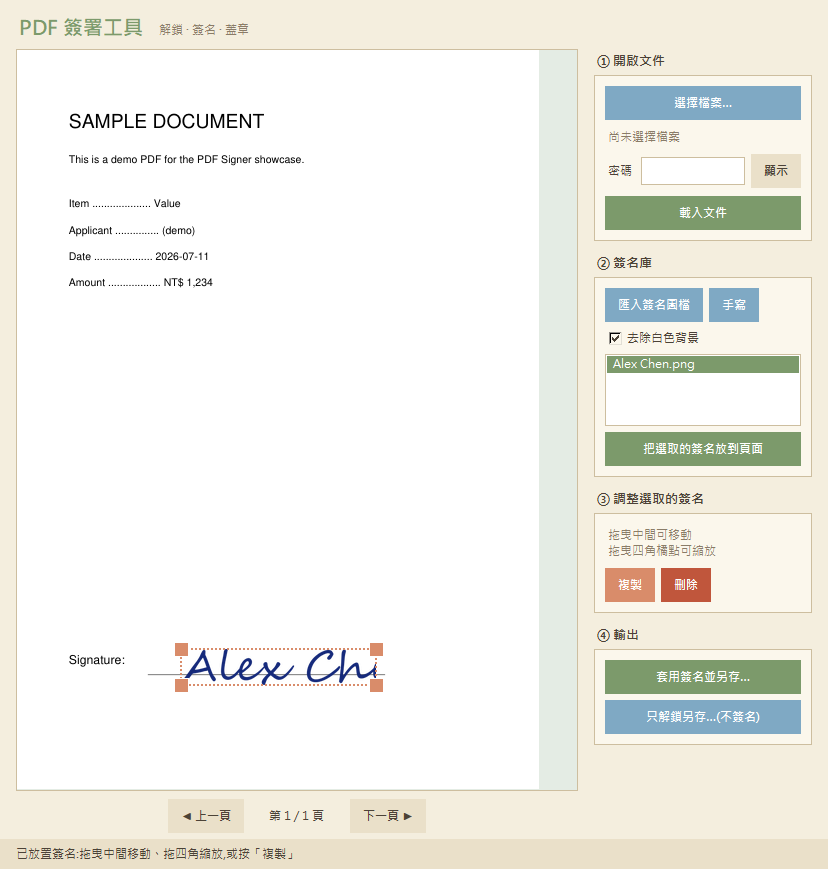

# PDF 簽署工具 · PDF Signer

> 一個輕量的 Windows 桌面小工具:解除 PDF 權限鎖、加上手寫／圖章式簽名。
> 介面採吉卜力風格暖色系,以 Python + tkinter + PyMuPDF 打造。

## 這是什麼

日常常遇到「收到一份 PDF,想直接簽名回傳,但檔案被設了權限鎖無法簽署」的情況。
這個小工具把 **解鎖 → 放簽名 → 調整位置大小 → 輸出** 整合成一個直覺的桌面程式,
不必印出來簽名再拍照上傳。

> ⚠️ 本工具做的是「圖章式／手寫簽名」(把簽名影像疊到 PDF 上),
> 並非憑證數位簽章(自然人憑證那種具備防竄改與身分綁定效力的簽章)。

## ✨ 功能特色

- **兩段式開檔** — 先選檔、輸入密碼(可切換顯示),再載入解析,順序直覺不卡住。
- **解除權限鎖** — 有權限密碼即可解禁簽署,並另存無限制版本。
- **簽名庫** — 可匯入多個簽名圖檔、或用滑鼠手寫;同一個簽名可重複蓋到不同位置。
- **直覺編輯** — 拖曳中間移動、拖曳四角縮放(維持長寬比),可複製、刪除。
- **自動去背** — 掃描或 JPG 的白底簽名自動變透明,不會蓋出白框。
- **自訂輸出檔名** — 另存時可自行命名。
- **多頁支援** — 不同頁面各自放簽名,一次輸出。

## 🛠️ 技術架構

| 項目 | 使用 |
|------|------|
| 語言 | Python 3.12 |
| 介面 | tkinter(純原生,無額外 UI 框架) |
| PDF 處理 | PyMuPDF(頁面渲染、蓋圖章、解密) |
| 影像 | Pillow(簽名去背、縮放、手寫合成) |
| 打包 | PyInstaller 單一 exe;Cython 將核心編譯成二進位 |

**運作流程**

1. 以密碼開啟並驗證 PDF,將頁面渲染成點陣圖顯示於畫布。
2. 簽名以透明 PNG 疊加在畫布上,滑鼠拖曳／四角縮放即時更新。
3. 輸出時把畫布座標換算回 PDF 點座標,將簽名影像嵌入頁面,另存為無加密的新檔。

## 🎨 設計

介面走吉卜力風格的暖色調:奶油米底色、龍貓葉綠的主要按鈕、天空藍的次要動作、
暖橘的選取與縮放把手。流程以 ①②③④ 分區,降低第一次使用的門檻。

## 📄 關於原始碼與授權

本 repo 為**作品介紹**,展示功能與設計思路,**未附完整實作原始碼**。

主要原因:PDF 渲染引擎 **PyMuPDF 採 AGPL-3.0 授權**,若公開散布相關實作會連帶
產生開源義務。為單純保留紀錄、同時尊重上游授權,這裡只放說明與截圖。

本說明文件與截圖以 [MIT 授權](LICENSE) 釋出。

---

個人專案 · 2026
